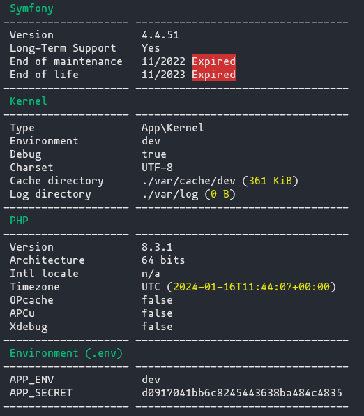

# PruebaSimfony
## Proyecto para Viajes para ti
### Versiones
- php 8.3.1
- Symfony 4.4.51


### Configuración del proyecto con symfony CLI
```
symfony new dbp-project --version="4.*.*" --webapp
```

## Estructura
### src/Controller/MainController.php
Archivo para gestionar las solicitudes HTTP
### src/Entity/Provider.php
Archivo con la clase Proveedor definida
### src/Form/Type/ProviderFormType.php
Archivo para gestionar/generar un formulario
### templates/base.html.twig
Archivo twig para con la base html de la que heredan las siguientes plantillas
### templates/provider/list.html.twig
Archivo twig con la estructura necesaria para mostrar la lista de proveedores
### templates/provider/create.html.twig
Archivo twig con la estructura necesaria para crear o editar un proveedor

## Funcionamiento
Pagina principal sin ningun proveedor creado

Pagina para crear un nuevo proveedor

Pagina con dos proveedores creados

Pagina para editar proveedor

Pop Up para borrar proveedor

